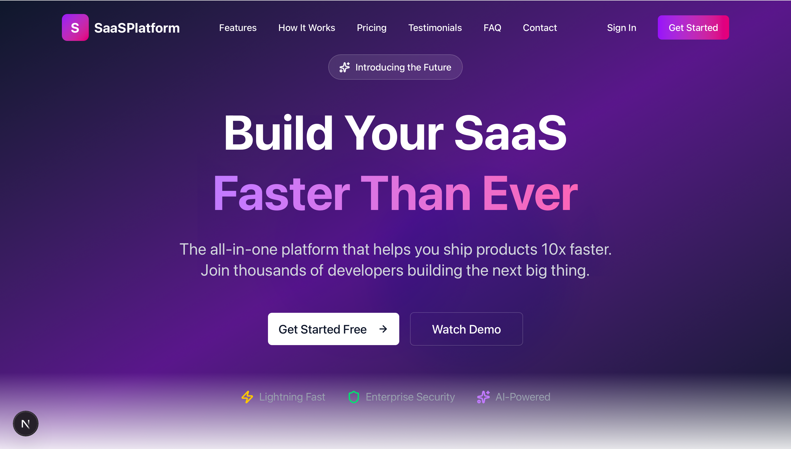
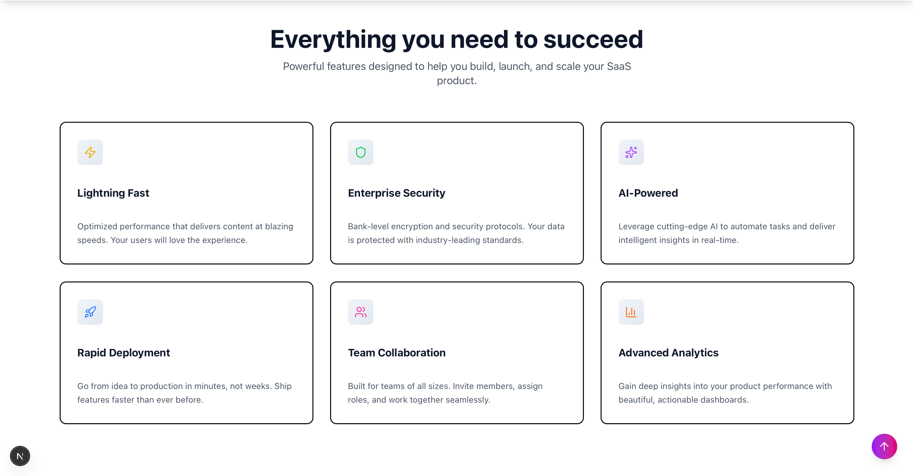
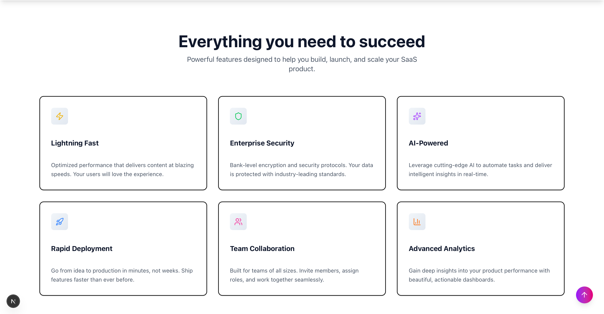
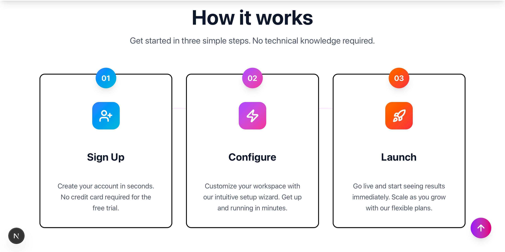
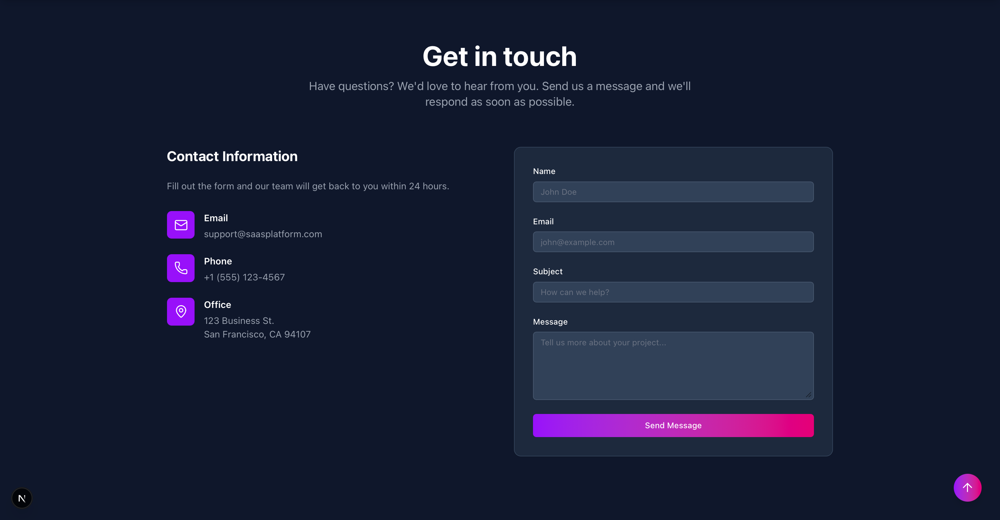
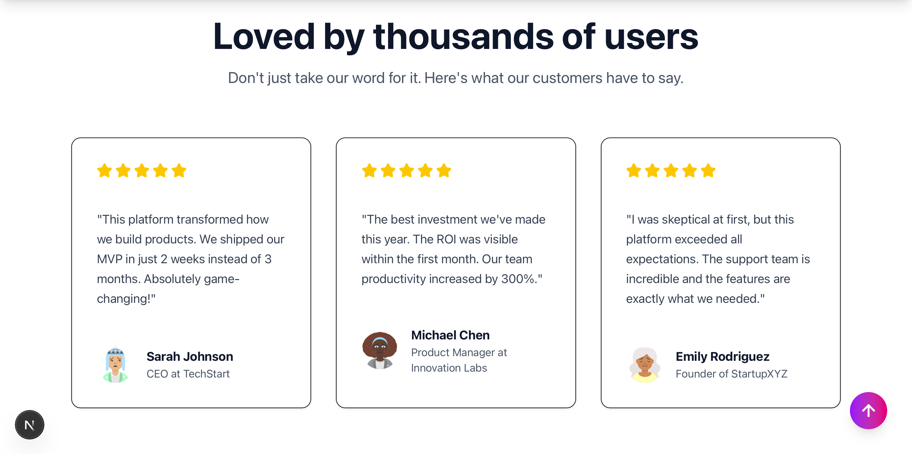
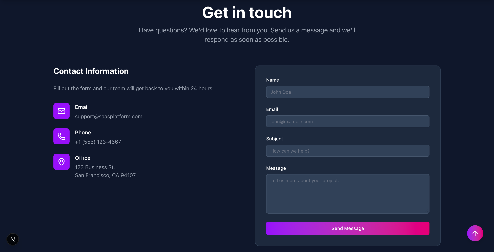
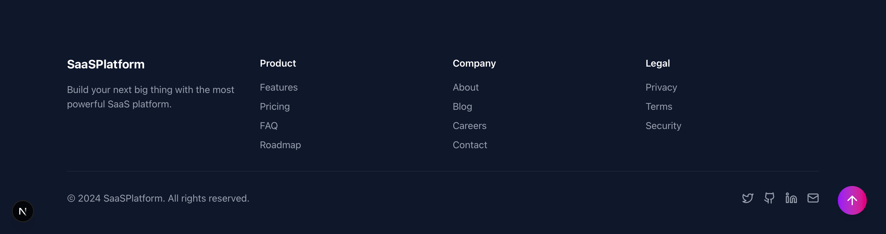

# SaaS Landing Page Template

A modern, fully-responsive SaaS landing page built with Next.js 15, TypeScript, Tailwind CSS, and Framer Motion.

## 🌟 Features

- ✨ **14 Professional Sections** - Complete landing page with all essential components
- 🎨 **Modern Animations** - Smooth Framer Motion animations throughout
- 📱 **Fully Responsive** - Perfect on mobile, tablet, and desktop
- ⚡ **Lightning Fast** - Built with Next.js 15 and optimized for performance
- 🎯 **Conversion Optimized** - Strategic CTAs and social proof elements
- 🔧 **Easy to Customize** - Clean code structure for quick client customization

## 📦 Sections Included

1. **Loading Animation** - Smooth page load experience
2. **Sticky Navigation** - Professional navbar with smooth scroll
3. **Hero Section** - Animated gradient with compelling CTAs
4. **Social Proof Ticker** - Scrolling company logos
5. **Stats Counter** - Animated numbers (10,000+ users, 99.9% uptime)
6. **Features Grid** - 6 feature cards with icons
7. **How It Works** - 3-step process visualization
8. **Pricing Table** - 3-tier pricing with "most popular" badge
9. **Testimonials** - Customer reviews with avatars
10. **Final CTA** - Last conversion opportunity
11. **FAQ Section** - Expandable accordion (8 questions)
12. **Contact Form** - Working form with validation
13. **Footer** - Professional footer with links
14. **Scroll-to-Top Button** - Appears when scrolling

## 🛠️ Tech Stack

- **Framework:** Next.js 15 (App Router)
- **Language:** TypeScript
- **Styling:** Tailwind CSS v4
- **Components:** shadcn/ui
- **Animations:** Framer Motion
- **Icons:** Lucide React
- **Deployment:** Vercel

## 🚀 Live Demo

[View Live Demo](https://your-demo-url.vercel.app/saas)

## 📸 Screenshots












## ⚙️ Installation
```bash
# Clone the repository
git clone https://github.com/yourusername/landing-templates.git

# Navigate to project
cd landing-templates

# Install dependencies
pnpm install

# Run development server
pnpm dev
```

Open [http://localhost:3000/saas](http://localhost:3000/saas) to view the template.

## 🎨 Customization

### Colors
Update the color scheme in `tailwind.config.ts` or directly in component classes.

### Content
All text content is hardcoded in components for easy customization:
- Hero: `components/sections/Hero.tsx`
- Features: `components/sections/Features.tsx`
- Pricing: `components/sections/Pricing.tsx`
- etc.

### Sections
Remove unwanted sections by simply commenting them out in `app/saas/page.tsx`.

## 📝 Environment Variables

Create a `.env.local` file:
```env
RESEND_API_KEY=your_resend_api_key_here
NEXT_PUBLIC_SITE_URL=http://localhost:3000
```

## 🌐 Deployment

### Deploy to Vercel

1. Push your code to GitHub
2. Go to [vercel.com](https://vercel.com)
3. Import your repository
4. Add environment variables
5. Deploy!

Your site will be live in minutes at `your-project.vercel.app`

## 📄 License

This template is available for commercial use. Feel free to customize and sell to clients.

## 👨‍💻 Author

Built by Emile
- Portfolio: [your-portfolio.com]
- GitHub: [@yourusername](https://github.com/yourusername)
- Email: your.email@example.com

## 🙏 Acknowledgments

- Built with [Next.js](https://nextjs.org/)
- UI components from [shadcn/ui](https://ui.shadcn.com/)
- Animations powered by [Framer Motion](https://www.framer.com/motion/)

---

**Note:** This is a template for client projects. Customize colors, content, and sections based on client needs.
